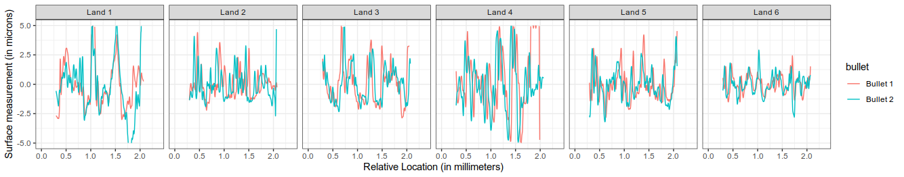

```{r setup, include=FALSE}
knitr::opts_chunk$set(echo = TRUE)
```


We thank the reviewer for his or her careful and constructive comments on our article, which we have retitled "Comparison of three similarity scores for bullet LEA matching". We have made numerous changes to the document in response to the suggestions made by the reviewer, and have responses to the comments which we could not address according to the suggestions. An included document shows the differences between the text in the original version and the text in the resubmitted version. 

## Summary
The aim of this article is to compare three different measures of LEA similarity, the author developed random forest score, the cross correlation and consecutive matching striae, determined from three Ruger bullet test sets.

## General comments
> In general, the article is clearly structured and well written. Some of the figures are a bit small, particularly the captions. More details are given below. One thing that I'm missing in the document is the step from score distribution determination to the calculation of the strength of the evidence, e.g. in the form of a score based likelihood ratio or calculate identification error rates. I strongly encourage the authors to add this to the document. In addition I think that the authors did a great evaluation using three different test sets. However, they only include Ruger bullets, which are known to mark very well and in fact, based on the results presented in the article, the added value of using the random forest score instead of cross correlation is not justified, in contrary. It would also be very interesting to see the performance on less well marking firearms as I think for those cases the random forest score should indeed perform better than the cross correlation. Finally I think that the document is pretty lengthy and detailed, given what you are studying, and I suggest to shorten some paragraphs.

Response: 

- We have addressed the figure legend/label size throughought the document. 
- The choice to exclude score-based likelihood ratios from the scope of this article was a conscious decision, as the land-to-land comparisons produce density estimates with different variability between known matches and known non-matches. As a result, in these cases, the SLR is nonmonotonic and produces unexpected and potentially misleading results at the extremes of the distribution (see Fig. 4 in Neumann and Ausdemore, https://arxiv.org/pdf/1910.05240.pdf). We would like to defer the explicit use of SLRs; we have added a paragraph on the potential of using likelihood ratios with the scoring methods described in the paper, as well as several mentions of how this method could be used with LRs in theory. 
- Error rates are present in the ROC curves presented in Figure 10 and are  presented more explicitly in Figure 11, which shows the equal errorr rates and thresholds for each land-to-land score. We have emphasized that at the bullet-to-bullet level, the distributions for each study are perfectly separated, indicating that the error rate would be nil. It is only when we proceed to analyze the land-to-land comparisons that we can do any sort of assessment of the error rate. 
- We appreciate the reviewer's discussion about the Ruger vs. non-Ruger bullets; we have included some of the suggestions in the paper, but do not currently have sufficient data to include a fourth case study in this paper. We agree that this would be an interesting test of the random forest score compared to the cross correlation and are planning several future studies which explore the random forest score's use on non-Ruger bullets. As this paper is already fairly lengthy, as noted by the reviewer, we feel that the addition of a non-Ruger case study is best reserved for one of these future papers. 
- We have (throughout the document) tightened up language to make the paper more succinct.


## Further comments

- Title: I think the title is not covering the content very well. How about "Comparison of three different similarity scores for bullet LEA matching" or something like that.

> We have modified the title according to the reviewer's suggestion

- Abstract: I think it's odd to refer to the article by Tai et al. as an example for an automated impression mark comparison algorithm that works on 2D images, particularly as you stated earlier in the abstract that you focus on 3D data. Therefore e.g. the AFFC/CMC algorithm developed by John Song at NIST would be more appropriate.

> We have included the additional reference to the CMC algorithm. 

- Abstract: "… enabling virtual comparisons…" Technically speaking, this is also possible with 2D data.

> We agree, thanks for the correction. The abstract has been modified to make it clear that the 3D microscopy allows for more precise virtual comparisons.

- Abstract: What do you mean with "external tests"?

> An external test set is one which was not used to train the algorithm - that is, data which the algorithm has not "seen" before. We have modified the language to avoid the terminology as it appears it is not common outside machine learning and statistics. 

- Abstract: "We are presenting a discussion of the performance of the matching algorithm [2] in three studies". This is misleading I think. Basically what you do is to compare the performance of three similarity metrics, your own random forest approach, cross correlation and CMS. The alignment is based on the cross correlation function, which is not novel or specific to your algorithm.

> The matching algorithm encompassess more than the alignment based on cross-correlation. It also involves several cleaning and smoothing steps, the selection of an appropriately stable crosscut, and the calculation of other metrics (e.g. peak identification, CMS calculation) after sequences are aligned based on maximal cross-correlation. While we evaluate different scoring metrics, all of these scoring metrics are calculated conditional on the alignment using the algorithm described in Hare et al. (2015). Thus, it is important to distinguish between the matching algorithm and the scoring mechanism. 

- Page 2: "… to assess the strength of a match …" The cross correlation is merely a similarity metric, that doesn't say anything about the strength of the match. For that you need reference data. An LR is a measure of the strength of a match. Same three lines down "… assessing match strength…". Please check whole document and revise.

> We have (throughout the paper) changed the language to distinguish between similarity metrics and match strength; we appreciate the importance of this clarification. 

- Methods: What is a "stable crosscut"?

> We have added a clause describing stable ccrosscuts as an area where striae are similar in the region above and below the crosscut. This excludes regions with damage that interfere with similarity score calculation

- Figure 1 is pretty small, particularly the caption font size. Furthermore I think it would be more illustrative to put two corresponding profiles in the same plot.

> We created a replacement for Figure 1 with the signatures overlaid, but found it difficult to read because the sequences are not (at this stage of the algorithm) aligned, so much of the similarity is difficult to see when the unaligned details are overlaid. We include the modified Figure 1 here as a demonstration, but ultimately feel that the original Fig 1 (with labels of increased size) allows for easier visual comparison of the peaks in the sequence.



- Page 4: "Note that with automatic alignment…. consecutive matching striae of zero". I don't understand this sentence.

> We have added some clarifying language. Essentially, because examiners align bullets based on peaks, there will always be at least one matching striation mark; we align based on cross-correlation, which does not guarantee that there will be any matching striae. So the measure of CMS used in this paper differs slightly from the measure of CMS used by examiners.

- Page 4: "… and with it may indicate that the two signatures come from the same source". Same issue as above. Based on the similarity metric only, you can't say anything about the strength of the evidence. For that you need reference distributions. Same eight lines down on the same page.

> The goal of this sentence and the sentence below it is to provide some intuition about the direction of the scoring mechanism: 0 indicates low similarity, 1 indicates extremely high correspondence. We have modified the language somewhat to make this clearer. 

- Page 4: "An automated algorithm selects a cutoff…". That is a choice and should as such be mentioned in the article. Some authors do indeed calculate a threshold, but many these days prefer a system that does not require to use a threshold and rather calculate a continuous measure like the LR.

> We have added some language to contrast our approach with SLRs: "Of course, in jurisdictions which utilize score-based likelihood ratios, this threshold system is not necessary because likelihood ratios are continuous. Even with likelihood ratios, however, there is a natural threshold at 1 which functions similarly to the selected threshold in the binary decision case."

- Page 4: What do you mean with stability? If your reference distribution is the same, the conclusion will always be the same. Or do you mean that automated systems should not include a random element that might lead to variability in the outcome?

> For each test set, we assemble a distribution of scores of known matches and non-matches that might serve as a reference distribution for similar firearms. Ideally, the threshold for separating a match score and a non-match score would be the same across different test sets. We have added some language to make this clearer when defining the term.

- Page 5: "When imaging bullets, operators scan one land at a time…" These days there are a couple of systems around that measure the whole bullet at once, e.g. IBIS 3D or Laboratory Imaging BalScan.

> We have added some language to this effect. 

- Figure 2: What does RF stand for? Random Forest score?

> We have defined RF in the figure legend.

- Page 6: What is a in the first formula?

> We have added some clarifying language indicating that the a's are the elements of the matrix A.

- Figure 3 is too small?

> We have increased the text size. 

- Page 7: "\*\*resolution\*\*". Was this intended?

> Thanks for catching that; we have fixed it. 

- I like the fact that the authors used three different test sets. Are these also publicly available or do the authors intend to do that? That would be great.

> We are working on gaining approval to publish a data paper with the data used in this paper, to make the land scans publicly available for additional analysis; we strongly agree with the reviewer that the community would benefit from access to these scans. At the moment, two of the three sets have been uploaded to NBTRD at a lower resolution than the resolution used in our calculations, but before we provide bulk downloads of the higher-resolution data, we must consult with CSAFE collaborators at NIST and other institutions. We are in the process of creating a [metadata-only figshare collection](https://doi.org/10.25380/iastate.c.4781447) with contact information to request the data (it will be available at once it is released by our librarians, but can be seen [here](https://figshare.com/s/bb22f76c9cb196a4f9d3) until that approval is granted). Once we have collaborator approval, we hope to submit a Data in Brief paper and upload the full datasets for public consumption.


- Ruger barrels are typically leaving very distinct and good marks on bullets. That might be the reason why the performance for random forest score and cross correlation is similar (Figure 7). There I suggest to extend the comparison study also to barrels that do not mark that well. In those scenarios the random forest approach should demonstrate to perform much better than simply using cross correlation. In other words, for Ruger bullets you don't need a random forest approach and can simply use cross correlation and that'll be sufficient. Looking at figure 10, the random forest approach is actually worse for most cases.

> We appreciate the reviewer's discussion about the Ruger vs. non-Ruger bullets; we have included some of the suggestions in the discussion section of the paper, but do not currently have sufficient data to include a fourth case study in this paper. We agree that this would be an interesting test of the random forest score compared to the cross correlation and are planning several future studies which explore the random forest score's use on non-Ruger bullets. As this paper is already fairly lengthy, as noted by the reviewer, we feel that the addition of a non-Ruger case study is best reserved for one of these future papers. 


- Page 13: "… we would need to considerably expand the database used for training". Same as in the previous comment. I'm afraid that simply training on Ruger data will not be enough as these are basically among the best marking barrels around. Fine tuning with less well marking barrels will probably necessary.

> We are aware that the random forest will need to be re-trained on a broader set of bullets, including non-Ruger bullets; this is another reason why we are hesitant to apply the random forest scoring algorithm to non-Ruger bullets - we need to re-train the model on more diverse data. 

- Page 13: It would of course be great to have perfectly separated distributions. However, if we calculate a score based LR (SLR) for each land and can show that the marks are independent, which they should be, then it is possible to multiply all individual SLRs. Even if we end up with a very low SLR for each individual land, say only SLR = 10, this would yield a bullet SLR of 10^6.

> We cannot recommend this course of action in part because the land to land scores are not independent, rather, they result from pairwise comparisons that are inherently dependent. Further, we can't assume that striae observed on different lands from the same physical bullet are independent, because they were all part of the same firing event. While this assumption is often made for practical purposes, the assumption is highly suspect and should not be further promoted without considering the covariance structures within the data. For this reason, we feel that the use of the sequence average match method for combining scores is more reasonable because it accounts for the spatial relationships between the set of lands belonging to the same bullet, without requiring assumptions of independence.

- Figure 10 is too small, particularly the caption fonts. Also specify which symbol is which score on the right column.

> We have modified the figure text size. The caption for the figure is located at the bottom between the two graphs, and does show which shapes are used for each score; however, each score is also explicitly labeled on the left-hand side of figure B. 

- It is a bit strange that the CMS is not part of the figures 7 and 9. You state that you compare the three scores, but you only do that in figure 10 and 11.

> We have fixed that - thank you for catching it!

- Peak valley detection may be tricky. Which algorithm did you use to determine the CMS?

> This is part of the matching algorithm described in Hare et al. (2017). We have made the reference to the algorithm more explicit, but do not feel we can completely explain the peak detection and matching process here without significantly lengthening the paper. As it is already part of the published record, citing the previous paper seems most appropriate.

- Figure 11 is too small.

> We have adjusted the text size in figures throughout the paper.

- Page 17: Known match and known non-match reference distributions for whole LEA marks and partial LEA marks are different, as the SLR is dependent on the width of the mark. The KM scores stay more or less the same, but the KNM scores get higher if the mark width get smaller. As your approach also includes cross correlation I assume the random forest score is also sensitive to mark width. As a result, probably LEAs with partial marks should just be discarded, as we luckily have a couple of LEAs left. Otherwise one would have to have reference distributions of different mark lengths available.

> Hare, Hofmann, and Carriquiry (2017) showed how to use the random forest score to match degraded and partial land impressions; the random forest score remained fairly stable up to 50% signature length, suggesting that the random forest score, at least, is relatively robust to degradation and partial mark size. For the reasons stated above, we do not carry this conclusion all the way to the calculation of SLRs, but given the previously cited paper, we do not expect to require a separate comparison distribution when the partial LEA includes at least 50% of the length of a full LEA signature. 

- It will be very interesting to see how your scores compare to score given by forensic examiners but even more interesting would be to compare the actual conclusions of the examiners with automatically determined conclusions (in the form of an SLR for example).

> We agree. The Houston FSC study data shown here were part of a larger examiner study; we are preparing a paper which compares the algorithm's performance using the decision criteria shown in this paper to the performance of firearm examiners and expect to submit this paper for review in mid 2020. 