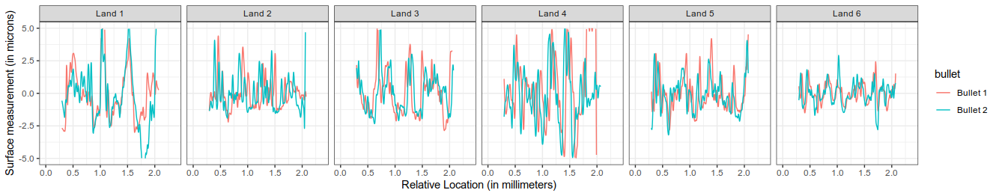

We thank the reviewer for his or her careful and constructive comments on our article, which we have retitled "Comparison of three similarity scores for bullet LEA matching". We have made numerous changes to the document in response to the suggestions made by the reviewer, and have responses to the comments which we could not address according to the suggestions. Rather than address each point in turn, we have summarized the requested changes, as some of the issues appear in several separate comments. We first address the minor changes and then discuss some of the broader, more conceptual comments. We would be happy to provide a point by point response to the reviewer's suggestions, if this format does not work.

\paragraph{Figures}
The figures have been adjusted to have a larger font size for labels and titles. The caption size is set by the LaTeX template and is thus not easily editable by the authors. We expect that the captions will be sized appropriately in the final product; at the moment, we do not have control over the sizing of the figure captions. We have added CMS to Figures 7 and 9; the ommission was an oversight that we are glad to have a chance to remedy.

We created a replacement for Figure 1 with the signatures overlaid, but found it difficult to read because the sequences are not (at this stage of the algorithm) aligned, so much of the similarity is difficult to see when the unaligned details are overlaid. We include the modified Figure 1 here as a demonstration, but ultimately feel that the original Fig 1 (with labels of increased size) allows for easier visual comparison of the peaks in the sequence.

\paragraph{Minor Narrative Changes}

We have modified the abstract in accordance with the reviewer's suggestions. We have also (throughout the paper) changed the language to distinguish between similarity metrics and match strength; we appreciate the importance of this clarification. 
As requested, we have added clarifying language and descriptions when referencing the matching algorithm, and in some cases made the references more explicit, such as when describing peak identification for CMS calculation. We have included references to BulletTrax and other full-bullet scanning systems. In addition, we have made efforts to reduce the wordiness of some explanations while maintaining sufficient detail to describe the process used to automatically match two bullets.

Finally, we have emphasized that at the bullet-to-bullet level, the distributions for each study are perfectly separated, indicating that the error rate would be nil. It is only when we proceed to analyze the land-to-land comparisons that we can do any sort of assessment of the error rate. 
<!-- I actually didn't change anything, but if we suggest we emphasized it, I think it will make it more obvious to the reviewer without calling it out directly  -->

The suggestions addressed thus far required relatively minor changes to the manuscript; the suggestions and comments we address next are somewhat more substantive. We have addressed these comments but would like to provide additional context for the way we have approached each suggestion.

\paragraph{Likelihood Ratios}
The choice to exclude score-based likelihood ratios from the scope of this article was a conscious decision, as the land-to-land comparisons produce density estimates with different variability between known matches and known non-matches. As a result, in these cases, the SLR is nonmonotonic and produces unexpected and potentially misleading results at the extremes of the distribution (see Fig. 4 in Neumann and Ausdemore, https://arxiv.org/pdf/1910.05240.pdf). We would like to defer the explicit use of SLRs; we have added a paragraph on the potential of using likelihood ratios with the scoring methods described in the paper, as well as several mentions of how this method could be used with LRs in theory.
<!-- The threshold-based model we used in this paper is more consistent with the model used by examiners in our jurisdiction: decisions include, broadly, identification (the bullets match), exclusion (the bullets do not match), inconclusive, and insufficient evidence to make a conclusion. Our computational model does not require the last two categories, reducing this problem to a binary decision with a single threshold. -->
<!-- We would also note that using likelihood ratios does not remove the need for a threshold; rather, it moves (implicitly or explicitly) to a threshold of 1, where scores greater than 1 indicate more evidence of a match than not, and scores less than 1 indicate more evidence of a non-match than a match. -->

As to the suggestion to use multiplication to combine land-to-land SLRs into a bullet-to-bullet SLR; we cannot recommend this course of action in part because the land to land scores are not independent, rather, they result from pairwise comparisons that are inherently dependent. Further, we can't assume that striae observed on different lands from the same physical bullet are independent, because they were all part of the same firing event. While this assumption is often made for practical purposes, the assumption is highly suspect and should not be further promoted without considering the covariance structures within the data. For this reason, we feel that the use of the sequence average match method for combining scores is more reasonable because it accounts for the spatial relationships between the set of lands belonging to the same bullet, without requiring assumptions of independence.

\paragraph{Suggestions for Expanded Scope}
We appreciate the reviewer's discussion about the Ruger vs. non-Ruger bullets; we have included some of the suggestions in the paper, but do not currently have sufficient data to include a fourth case study in this paper. We agree that this would be an interesting test of the random forest score compared to the cross correlation and are planning several future studies which explore the random forest score's use on non-Ruger bullets. As this paper is already fairly lengthy, as noted by the reviewer, we feel that the addition of a non-Ruger case study is best reserved for one of these future papers. Regarding the suggestion to compare decisions made by the algorithm to decisions made by the examiner, the Houston FSC study data shown here were part of a larger examiner study; we are preparing a paper which compares the algorithm's performance using the decision criteria shown in this paper to the performance of firearm examiners and expect to submit this paper for review in mid 2020. 

The final wider-scope comment addresses the matching of partial signatures, specifically suggesting that these signatures should be compared to a reference distribution assembled from partial signature comparisons. Hare, Hofmann, and Carriquiry (2017) showed how to use the random forest score to match degraded and partial land impressions; the random forest score remained fairly stable up to 50% signature length, suggesting that the random forest score, at least, is relatively robust to degradation and partial mark size. For the reasons stated above, we do not carry this conclusion all the way to the calculation of SLRs, but given the previously cited paper, we do not expect to require a separate comparison distribution when the partial LEA includes at least 50% of the length of a full LEA signature. 

\paragraph{Data in Brief}
We are working on gaining approval to publish a data in brief paper with the data used in this paper, to make the land scans publicly available for additional analysis; we strongly agree with the reviewer that the community would benefit from access to these scans. At the moment, two of the three sets have been uploaded to NBTRD at a lower resolution than the resolution used in our calculations, but before we provide bulk downloads of the higher-resolution data, we must consult with CSAFE collaborators at NIST and other institutions. We are in the process of creating a [metadata-only figshare collection](https://doi.org/10.25380/iastate.c.4781447) with contact information to request the data (it will be available at once it is released by our librarians, but can be seen [here](https://figshare.com/s/bb22f76c9cb196a4f9d3) until that approval is granted). Once we have collaborator approval, we hope to submit a Data in Brief paper and upload the full datasets for public consumption.

